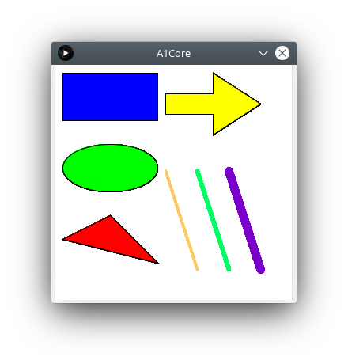
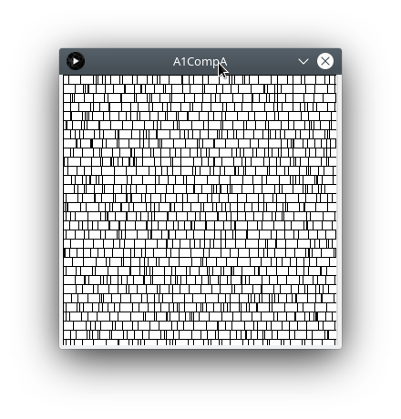
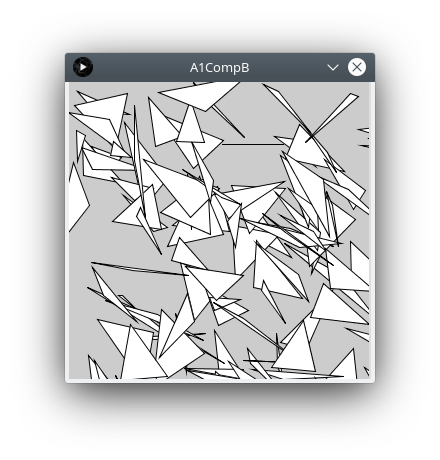
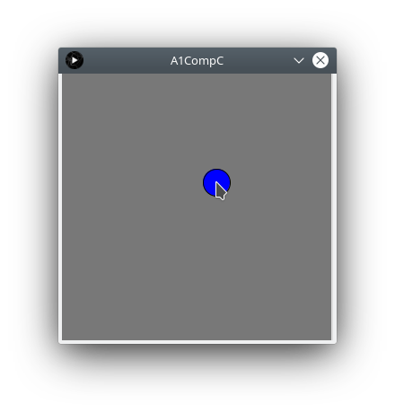
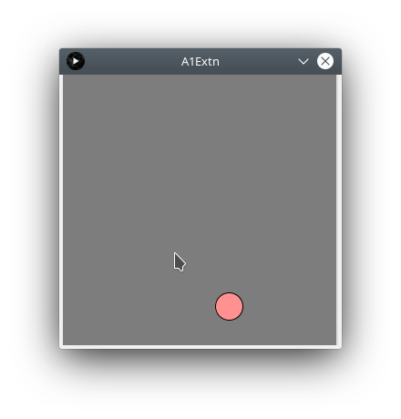
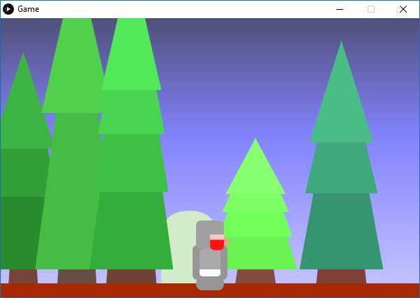

# CGRA 151 - Introduction to Computer Graphics

### Course learning objectives
Students who pass this course should be able to:

1. Write simple programs in the Processing programming language
2. Understand, be able to explain and reproduce a range of fundamental computer graphics algorithms, including line drawing, triangle drawing, clipping, and curve drawing.
3. Understand and use the vector and matrix representations in homogenous co-ordinate systems, to perform geometric transformations.
4. Understand and explain the human visual system, its limitations, and the implications these limitations have on epresentations of colour, display resolution, and quantisation. Describe a number of colour spaces and their relative merits. Explain the basics of the key display technologies in current use.

### Note
This document covers projects and assignments made while studying CGRA151 - Introduction to Computer Graphics.

The source files are unable to be published to the public to help ensure academic integrity and due to copyright concerns involved with the assignment scaffolding.

# Assignments

## Assignment 1 - Introduction to the processing language
### Purpose
#### Part 1
Recreate a number of images provided in a reference worksheet.

A set of static image items

Random images based on squares and triangles

A circle that is centred on the mouse and changes color when clicked

#### Part 2
The second part was to create a pleasing animated sequence or interactive piece of "art". 

A ball was created that bounces when the user clicks, additionally, when the ball makes a full "lap" it increases it's speed and shifts colors to be more red.

## Final Project - Work in Progress

### Purpose
This final project is to show a program using many of the techniques taught to produce a final product.
The project will be a sidescrolling game, with procedurally generated background (rocks and trees).
